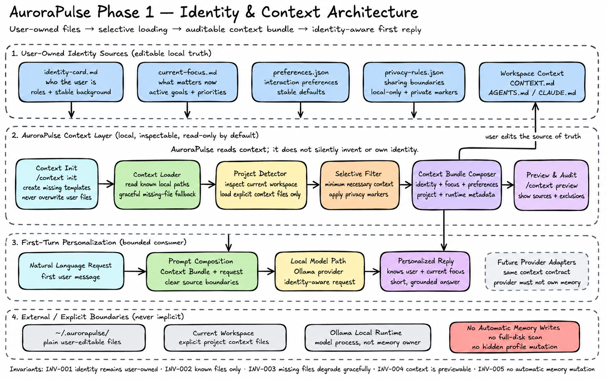
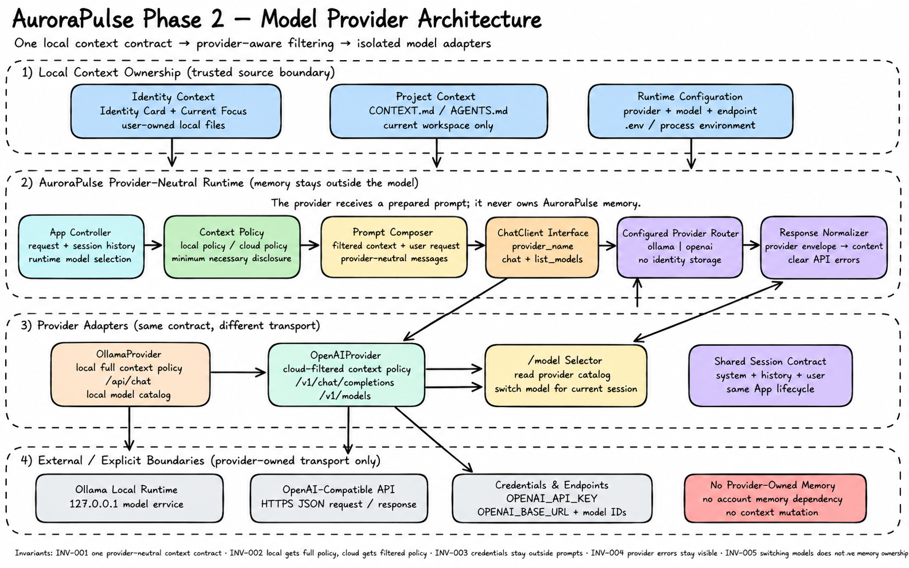
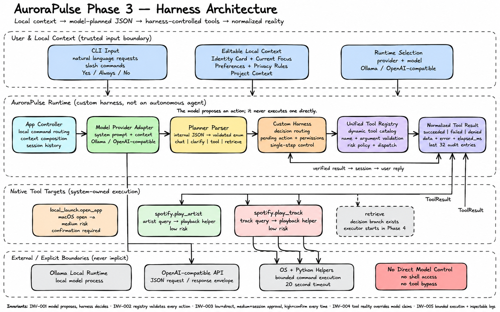

# AuroraPulse

**English** | [简体中文](README.zh-CN.md)

AuroraPulse is a local identity and memory layer for AI agents.

Its product north star is:

> Tell Aurora once. Every AI you authorize can know you.

Aurora keeps a user-owned source of truth on the local machine and will expose only the context an authorized AI needs for the current task. Identity, current focus, preferences, memory, and disclosure policy belong to Aurora and the user rather than to any model provider.

The current implementation is the Rust foundation for that product: a CLI with editable local context, Ollama and OpenAI-compatible providers, structured planner decisions, a custom harness, and permission-controlled native tools. Phase 4 adds the first external product boundary: a read-only local MCP server that lets authorized agents request scoped Context Packs.

## Current Foundation

- Editable identity card
- Current focus file
- Stable preferences
- Privacy rules
- Current project context from `CONTEXT.md`, `AGENTS.md`, or `CLAUDE.md`
- Context bundle preview
- Ollama and OpenAI-compatible model providers
- Structured planner decisions and a custom harness
- Unified native tool registry with centralized risk policy
- Inspectable normalized tool results
- Read-only local MCP identity server with structured Context Packs
- Dynamic redaction markers and local MCP access audit logs

## MCP Identity Server

Phase 4 turns the existing local context layer into an MCP identity service for other agents. The slice stays intentionally small:

- A local stdio MCP server
- Read-only identity, current-focus, and personal-context tools
- Task-scoped Context Packs with source metadata
- Minimum-necessary disclosure and explicit sensitive-data boundaries
- An end-to-end Codex integration proving that a new task can know the user without repeated setup

The end-to-end flow was verified with a fresh Codex task on 2026-07-18. Codex discovered and called `get_identity` and `get_current_focus`, then answered from `aurora://identity-card.md` and `aurora://current-focus.md` without reading workspace files.

Long-term memory writes, broad document ingestion, and voice remain deferred until the read-only cross-agent identity flow has more real usage.

## Local Identity Files

By default AuroraPulse looks in:

```text
~/.aurorapulse/identity-card.md
~/.aurorapulse/current-focus.md
~/.aurorapulse/preferences.json
~/.aurorapulse/privacy-rules.json
```

You can start from the examples in this repo:

```bash
mkdir -p ~/.aurorapulse
cp examples/identity-card.md ~/.aurorapulse/identity-card.md
cp examples/current-focus.md ~/.aurorapulse/current-focus.md
cp examples/preferences.json ~/.aurorapulse/preferences.json
cp examples/privacy-rules.json ~/.aurorapulse/privacy-rules.json
```

These files are plain user-owned data. Open them directly and edit them whenever your identity, focus, preferences, or privacy boundaries change.

## Run

```bash
cargo run -- .
```

Inside the CLI:

```text
/context init
/context preview
/model
/mcp log
/tools
/tools log
```

`/context init` creates the local context files if they do not exist.

`/context preview` shows the context bundle AuroraPulse will inject before calling the model.

`/tools` shows the exact tool catalog injected into the planner prompt. `/tools log` shows the
most recent normalized tool results and execution timing for the current process.

`/mcp log` shows recent external Agent context access, including the client, tool, returned source URIs, and redaction count.

Any normal request is sent to the model with local identity context prepended:

```text
我下一步应该做什么？
```

To run Aurora as a local MCP server:

```bash
cargo build --release
./target/release/aurora serve .
```

To register that release binary with Codex:

```bash
codex mcp add aurora \
  --env AURORA_MCP_CLIENT=codex \
  -- "$(pwd)/target/release/aurora" serve "$(pwd)"
```

The stdio server exposes three read-only tools: `get_identity`, `get_current_focus`, and `search_personal_context`.

## Environment

```env
AURORA_PROVIDER=ollama
OLLAMA_MODEL=gemma4:e4b
OLLAMA_URL=http://127.0.0.1:11434
```

For an OpenAI-compatible cloud provider:

```env
AURORA_PROVIDER=openai
OPENAI_API_KEY=...
OPENAI_BASE_URL=https://api.openai.com
OPENAI_MODEL=gpt-4o-mini
```

`OPENAI_BASE_URL` may point at a compatible gateway. AuroraPulse appends `/v1/chat/completions` unless the base URL already ends in `/v1`.

Optional path overrides:

```env
AURORA_HOME=/path/to/local/context
AURORA_IDENTITY_CARD=/path/to/identity-card.md
AURORA_CURRENT_FOCUS=/path/to/current-focus.md
AURORA_PREFERENCES=/path/to/preferences.json
AURORA_PRIVACY_RULES=/path/to/privacy-rules.json
```

## Current Rust Structure

```text
src/
  main.rs
  app.rs
  cli.rs
  config.rs
  context/
    mod.rs
  harness.rs
  model/
    mod.rs
    ollama.rs
    openai.rs
  planner.rs
  session.rs
  startup_animation.rs
  theme.rs
  tools/
    mod.rs
tests/
  app_runtime.rs
  context_loading.rs
  harness_runtime.rs
  planner_schema.rs
  startup_cli.rs
```

## Architecture Diagrams

Phase-by-phase architecture images and reproducible Imagine 2 prompts are maintained in [docs/architecture/phase-diagrams](docs/architecture/phase-diagrams/README.md).

### Phase 1: Identity & Context



Phase 1 establishes user-owned identity files, selective local context loading, an auditable Context Bundle, and identity-aware first replies.

### Phase 2: Model Providers



Phase 2 adds a provider-neutral model boundary, provider-aware context filtering, Ollama and OpenAI-compatible adapters, and runtime model selection.

### Phase 3: Harness Runtime



Phase 3 completes the structured planner, custom Harness, unified Tool Registry, centralized permission policy, normalized tool results, bounded execution, and inspectable logs.

Phase 1 through Phase 4 are complete. **Phase 4: MCP Identity Server was verified with Codex on 2026-07-18.** The next phase is durable, user-correctable personal memory.

## Not V1

- Full-disk scanning
- Automatic long-term memory
- Voice loop
- Cloud-provider-owned memory
- Unrestricted context dumps to agents
